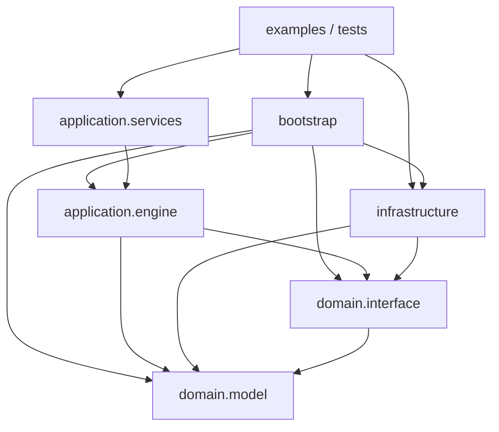
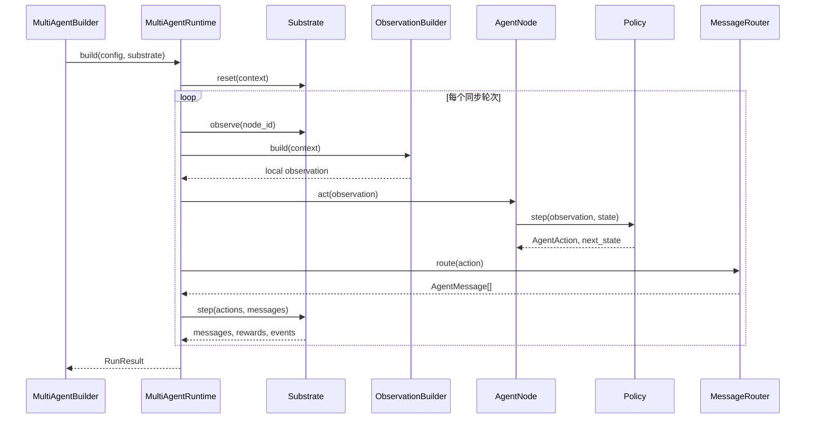
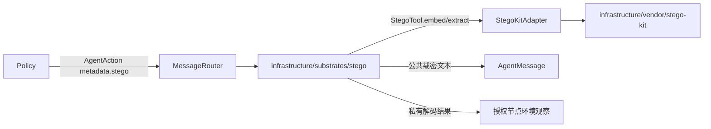
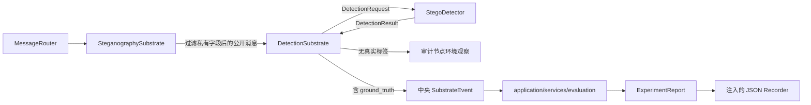

# StegoPot 架构说明

本文档定义 StegoPot Python 业务包的四层目录、仓库级展示子项目、依赖方向、
运行调用链和扩展规则。
`tests/test_architecture.py` 会自动验证这些约束。

## 核心约束

1. Python 包目录 `stegopot/` 只允许存在 `domain`、`application`、
   `infrastructure` 和 `bootstrap` 四个逻辑层。
2. 抽象接口和稳定模型属于最内层，不能依赖运行器或具体实现。
3. 应用层和基础设施层相互独立，通过领域接口协作。
4. 只有启动层负责选择并组装具体实现。
5. 复杂能力使用独立功能目录，例如 `infrastructure/substrates/stego/`。
6. 依赖只能由外层指向内层，禁止循环和反向依赖。

## 目录结构

```text
仓库根目录/
├── stegopot/                            # Python 四层业务包
│   ├── domain/                          # L0：稳定内核
│   │   ├── model/                       # 纯数据与领域规则
│   │   │   ├── action.py
│   │   │   ├── detection.py
│   │   │   ├── message.py
│   │   │   └── topology.py
│   │   └── interface/                   # ABC、Protocol 与能力契约
│   │       ├── policy.py
│   │       ├── detector.py
│   │       ├── llm.py
│   │       ├── observation.py
│   │       ├── substrate.py
│   │       └── stego.py
│   ├── application/                     # L1：框架运行与应用服务
│   │   ├── engine/
│   │   │   ├── agent.py
│   │   │   ├── observation.py
│   │   │   ├── router.py
│   │   │   └── runtime.py
│   │   └── services/
│   │       ├── evaluation.py
│   │       └── experiment.py
│   ├── infrastructure/                  # L2：具体实现和技术细节
│   │   ├── detectors/
│   │   │   ├── keyword.py
│   │   │   ├── llm.py
│   │   │   ├── mock.py
│   │   │   └── perplexity.py
│   │   ├── llm/
│   │   │   ├── clients/
│   │   │   │   ├── deepseek.py
│   │   │   │   └── mock.py
│   │   │   ├── action_parser.py
│   │   │   ├── policy.py
│   │   │   └── prompt.py
│   │   ├── substrates/
│   │   │   ├── communication.py
│   │   │   ├── detection/
│   │   │   │   └── substrate.py
│   │   │   └── stego/
│   │   │       └── substrate.py
│   │   ├── integrations/
│   │   │   └── stegokit/
│   │   │       ├── adapter.py
│   │   │       └── loader.py
│   │   ├── settings/
│   │   │   └── env.py
│   │   ├── recorders/
│   │   │   └── json.py
│   │   └── vendor/
│   │       └── stego-kit/               # 上游 Git 子模块
│   └── bootstrap/                       # L3：组合根
│       ├── builder.py
│       └── detection.py
└── stegopot-console/                    # 独立展示子项目
    ├── backend/                         # 报告脱敏投影与 HTTP API
    ├── frontend/                        # React 实验工作台
    └── contracts/                       # 版本化 JSON Schema
```

## 仓库级展示子项目

`stegopot-console/` 不属于 Python 业务包的第五层，也不参与运行时对象组装。
它通过文件边界读取 `ExperimentReport` JSON，再由后端投影成稳定、脱敏的
`ExperimentView` 契约。前端只消费 HTTP JSON。

```text
StegoPot Runtime -> ExperimentReport JSON -> Console Backend -> Console Frontend
```

- Console 后端不得导入 `stegopot` Python 包。
- 完整研究报告不得直接返回浏览器，必须经过投影器。
- 公开视图不得包含秘密比特、解码比特、逐消息真值或原始观察。
- 前端不得引用 Python 源码、业务实体或内部报告对象。

## 四层职责

### L0：Domain

`domain/model` 保存 `AgentAction`、`AgentMessage`、`AgentTopology`、
`DetectionRequest` 和 `DetectionResult` 等稳定领域对象。它只依赖 Python
标准库。

`domain/interface` 集中保存所有可替换能力的抽象契约：

- `Policy`
- `LLMClient`
- `ObservationBuilder`
- `Substrate`
- `StegoTool`
- `StegoDetector`

接口所需的请求、结果和上下文与接口放在同一文件中。该区域只能依赖
`domain/model`，不能导入应用层或基础设施实现。

### L1：Application

`application/engine` 实现节点状态、消息路由、默认观察和同步轮次调度。
它只认识领域模型和抽象接口，不知道 DeepSeek、StegoKit 或具体 Substrate。

`application/services` 存放完整应用用例，例如运行场景、计算检测和隐写
指标并生成 `ExperimentReport`。应用服务可以调用 Engine，但不能选择
基础设施实现或直接写入特定存储。

### L2：Infrastructure

基础设施层提供领域接口的具体实现：

- `llm`：LLMPolicy、提示构造、动作解析和模型供应商客户端。
- `detectors`：Mock、关键词、困惑度和 LLM 等检测器实现。
- `substrates`：通信、隐写、检测装饰器及未来环境规则。
- `integrations`：把第三方 API 映射到稳定接口。
- `recorders`：JSON、数据库等实验报告持久化实现。
- `settings`：环境变量等技术配置读取。
- `vendor`：必须固定版本的上游源码。

基础设施层不得导入应用层。不同基础设施功能之间也应通过领域接口协作；
例如 `SteganographySubstrate` 依赖 `StegoTool`，而不是 `StegoKitAdapter`；
`DetectionSubstrate` 依赖 `StegoDetector`，而不是某个具体检测器。

### L3：Bootstrap

`bootstrap` 是组合根。它可以同时导入 Engine 和具体基础设施实现，负责：

- 创建节点和拓扑；
- 为接口选择默认实现；
- 注入 Policy、ObservationBuilder 和 Substrate；
- 返回可运行的 `MultiAgentRuntime`。

`MultiAgentBuilder` 属于这一层。Builder 只负责接线，不实现路由、模型调用或
隐写算法。

## 依赖方向



允许的项目依赖如下：

| 当前区域 | 可以依赖 |
| --- | --- |
| `domain.model` | 自身、Python 标准库 |
| `domain.interface` | `domain.model`、自身 |
| `application.engine` | `domain.model`、`domain.interface`、自身 |
| `application.services` | `application.engine`、领域层、自身 |
| `infrastructure.settings` | 自身、Python 标准库 |
| `infrastructure.llm` | 领域层、`infrastructure.settings`、自身 |
| `infrastructure.detectors` | 领域层、自身 |
| `infrastructure.substrates` | 领域层、自身 |
| `infrastructure.integrations` | `domain.interface`、自身 |
| `infrastructure.recorders` | 自身、Python 标准库 |
| `bootstrap` | 所有层；只能做对象组装 |

## Runtime 调用链



同一轮所有节点只能看到上一轮收件箱。Substrate 处理后的消息在下一轮进入
接收节点观察，节点注册顺序不会改变同轮可见信息。

## 隐写调用链



关键隔离点：

- Stego Substrate 只依赖 `StegoTool` 接口。
- StegoKitAdapter 只负责类型映射，不参与路由和权限判断。
- 只有 StegoKit loader 可以定位 `infrastructure/vendor/stego-kit`。
- 秘密比特和算法材料不会进入公开 AgentMessage 元数据。

## 检测调用链



关键隔离点：

- `DetectionSubstrate` 是装饰器，必须在内部环境完成消息变换后再检测。
- `DetectionRequest` 只包含公开正文、公开元数据和公开实验上下文。
- 审计节点只能读取 `DetectionFinding`，其中不包含 `ground_truth`。
- TP、TN、FP、FN 只根据中央环境事件计算。
- 记录器只接收可序列化映射，不依赖应用服务或运行器类型。

## 新代码放置规则

### 新增领域模型

放入 `domain/model/`。模型不得包含网络请求、文件系统适配或运行器状态。

### 新增抽象能力

1. 在 `domain/interface/` 中定义 ABC 或 Protocol。
2. 请求、结果和上下文放在同一接口文件。
3. 具体实现放入 `infrastructure/` 的对应功能目录。
4. 调用者通过构造参数接收接口，不在内层实例化具体实现。

### 新增 Substrate

简单实现可放在 `infrastructure/substrates/<feature>.py`。包含多个组件时使用：

```text
infrastructure/substrates/<feature>/
├── __init__.py
├── substrate.py
├── state.py
└── ...
```

### 新增第三方工具

适配器放入 `infrastructure/integrations/<provider>/`。需要固定上游源码时，
源码放入 `infrastructure/vendor/<project>/`，并通过 loader 延迟加载。

### 新增检测器

1. 检测请求、结果和接口放在领域层。
2. 具体检测器放入 `infrastructure/detectors/<name>.py`。
3. 检测器不得读取 `AgentAction.metadata["stego"]`、秘密比特或真实标签。
4. 需要模型时通过构造参数接收 `LLMClient` 或本地模型，不在内部硬编码供应商。

### 新增记录器

持久化实现放入 `infrastructure/recorders/`。记录器只接收标准 Mapping，
不得导入 `ExperimentReport`、`RunResult` 或应用层模块。

### 新增应用用例

纯用例编排放入 `application/services/`。当用例需要选择具体实现时，将选择和
对象组装放入 `bootstrap/`。

## 禁止模式

- 在 `stegopot/` 根目录增加第五个逻辑包。
- 重建根级 `core`、`interface`、`llm`、`substrates` 等技术包。
- 新建通用 `utils`、`tools` 或空 `configs` 目录。
- 在 `application` 中导入 `infrastructure`。
- 在 `domain` 中导入 `application`、`infrastructure` 或 `bootstrap`。
- 在 Substrate 中直接导入第三方 SDK 或其适配器。
- 通过高层包重导出隐藏真实依赖方向。

## 自动检查

运行：

```powershell
.\.venv\Scripts\python.exe -m unittest tests.test_architecture -v
```

架构测试会检查：

- 包根目录是否只有四个逻辑层；
- 每个逻辑区域的项目内导入是否符合允许方向；
- ABC 和 Protocol 是否只声明在 `domain/interface/`；
- 旧的平级技术包和混合目录是否重新出现。

## 导入路径迁移

| 旧路径 | 新路径 |
| --- | --- |
| `stegopot.domain` | `stegopot.domain.model` |
| `stegopot.interface` | `stegopot.domain.interface` |
| `stegopot.core` | `stegopot.application.engine` |
| `stegopot.application.MultiAgentBuilder` | `stegopot.bootstrap.MultiAgentBuilder` |
| `stegopot.application.run_episode` | `stegopot.application.services.run_episode` |
| `stegopot.llm` | `stegopot.infrastructure.llm` |
| `stegopot.substrates` | `stegopot.infrastructure.substrates` |
| `stegopot.integrations` | `stegopot.infrastructure.integrations` |
| `stegopot.settings` | `stegopot.infrastructure.settings` |
| `stegopot/vendor/stego-kit` | `stegopot/infrastructure/vendor/stego-kit` |
