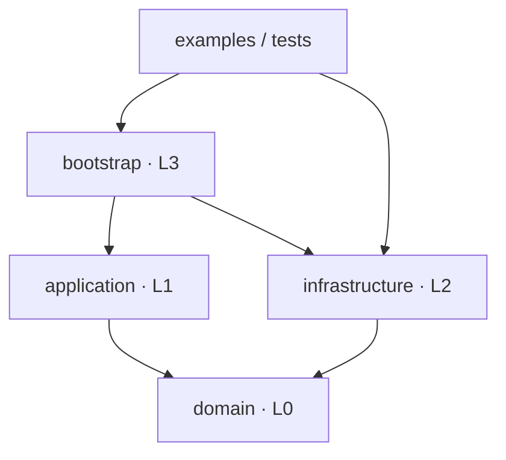
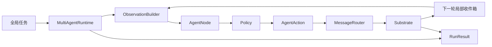

<p align="center">
  
</p>

<h1 align="center">StegoPot</h1>

<p align="center">面向多智能体通信与生成式文本隐写研究的轻量实验框架。</p>

<p align="center">
  <a href="https://www.python.org/"></a>
  <a href="https://github.com/Xinyuan20061/stegopot"></a>
  <a href="LICENSE"></a>
</p>

StegoPot 将智能体身份、决策策略、通信拓扑、运行调度、环境规则和隐写
工具拆分为独立组件。研究者可以先用可预测的离线模型验证多智能体流程，
再接入 DeepSeek 等真实 LLM，并通过 Substrate 环境层控制消息变换、
节点可见信息、奖励、事件和终止条件。

当前版本已经能够运行自定义拓扑的多智能体交互，并通过
[Dwinovo/StegoKit](https://github.com/Dwinovo/stego-kit) 执行真实的生成式
隐写编码与解码。项目仍处于研究原型阶段，不应被视为已经过安全审计的
隐蔽通信产品。

## 核心能力

- **自定义通信拓扑**：使用有向图精确约束节点之间的消息发送权限。
- **可插拔智能体策略**：同一运行器可组合 LLM、规则策略或测试策略。
- **DeepSeek 接入**：支持从 `.env` 读取密钥、超时、重试和结构化动作解析。
- **同步轮次调度**：同一轮的节点基于相同历史独立决策，消息在下一轮可见。
- **环境基底接口**：Substrate 统一承载消息变换、局部观察、奖励、事件和终止规则。
- **StegoKit 适配**：以工具协议隔离第三方实现，支持按需加载本地子模块。
- **可审计运行结果**：记录轮次、动作、消息、路由错误、奖励、环境事件和最终状态。
- **离线可复现测试**：Mock LLM 与确定性微型语言模型无需网络或模型下载。

## 当前可以完成什么

| 场景 | 当前状态 | 说明 |
| --- | --- | --- |
| 自定义多智能体网络 | 可用 | 支持任意节点、任意有向边以及环形、星形、全连接拓扑 |
| LLM 节点协作 | 可用 | DeepSeek 负责把局部观察转换为结构化动作 |
| 定向发送与广播 | 可用 | 发送目标必须满足拓扑约束；空目标表示广播给全部出邻居 |
| 运行记录与回放数据 | 可用 | `RunResult` 可转换为适合 JSON 序列化的字典 |
| 自定义环境规则 | 可用 | 可实现消息过滤、状态、奖励、事件和提前终止 |
| 生成式文本隐写 | 可用 | StegoKit 负责载密文本生成与授权节点解码 |
| 隐写检测与攻防评估 | 尚未实现 | 当前没有检测器、统计指标、对抗训练或基准实验 |
| 分布式执行与可视化界面 | 尚未实现 | 当前运行器为单进程同步调度，主要通过 Python API 使用 |

项目采用强制单向依赖的分层结构。完整目录职责、允许依赖、Runtime
时序和隐写调用链见 [ARCHITECTURE.md](ARCHITECTURE.md)。

## 架构

### 层级依赖



包根目录只保留四个逻辑层。依赖只能沿箭头方向流动：`domain` 保存模型和
抽象接口，`application` 保存运行引擎，`infrastructure` 提供具体实现，
`bootstrap` 负责选择并组装这些实现。

### 运行调用链



### 组件职责

| 组件 | 所在层 | 职责 |
| --- | --- | --- |
| `AgentAction` / `AgentMessage` / `AgentTopology` | `domain/model` | 稳定领域数据与拓扑规则 |
| `Policy` / `LLMClient` / `Substrate` / `StegoTool` | `domain/interface` | 可替换组件的抽象契约 |
| `AgentNode` / `MessageRouter` / `MultiAgentRuntime` | `application/engine` | 节点状态、路由和同步调度 |
| `LLMPolicy` / `DeepSeekClient` | `infrastructure/llm` | LLM 决策与供应商客户端实现 |
| `CommunicationSubstrate` / `SteganographySubstrate` | `infrastructure/substrates` | 具体环境规则 |
| `StegoKitAdapter` | `infrastructure/integrations` | 将 StegoTool 契约映射到第三方工具 |
| `MultiAgentBuilder` | `bootstrap` | 组合策略、运行引擎与环境 |

这种边界允许单独替换模型供应商、节点策略、拓扑或隐写算法，而无需修改
运行器的其他部分。

### 单轮执行语义

1. Runtime 为每个活跃节点构造局部观察，包括任务、共享上下文、上一轮收件箱和环境观察。
2. 每个节点通过自己的 Policy 产生 `message`、`wait`、`audit` 或 `final_answer` 动作。
3. MessageRouter 根据有向拓扑校验目标并生成候选消息。
4. Substrate 处理候选消息，生成奖励、事件和下一轮可见的环境状态。
5. 经环境允许的消息进入接收节点下一轮的收件箱。
6. 达到终止条件后，Runtime 返回完整 `RunResult`。

同轮消息不会立即影响后执行节点，因此节点注册顺序不会改变该轮可见信息。

## 项目结构

```text
.
├── assets/
│   └── stegopot-icon.png                  # 项目图标
├── examples/
│   ├── multi_agent_mock_demo.py           # 离线三节点协作
│   ├── deepseek_reply_test.py              # 单次 DeepSeek 回复
│   ├── multi_agent_deepseek_demo.py        # DeepSeek 三节点协作
│   └── steganography_interaction_demo.py   # StegoKit 隐写交互
├── stegopot/
│   ├── domain/                             # L0：稳定内核
│   │   ├── model/                          # 领域模型与规则
│   │   └── interface/                      # ABC、Protocol 与稳定契约
│   ├── application/                        # L1：框架运行与应用服务
│   │   ├── engine/                         # 节点、路由、观察和 Runtime
│   │   └── services/                       # 完整应用用例
│   ├── infrastructure/                     # L2：具体实现与技术细节
│   │   ├── llm/                            # LLM 策略与客户端
│   │   ├── substrates/
│   │   │   └── stego/                      # 隐写环境功能目录
│   │   ├── integrations/
│   │   │   └── stegokit/                   # StegoKit 适配器和加载器
│   │   ├── settings/                       # .env 配置读取
│   │   └── vendor/
│   │       └── stego-kit/                  # 上游 Git 子模块
│   └── bootstrap/                          # L3：Builder 与对象组装
├── tests/                                  # 行为与架构测试
├── ARCHITECTURE.md                         # 分层和调用关系规范
├── AGENTS.md                               # 后续代码开发约束
├── .env.example                            # 环境变量模板
├── .gitmodules                             # StegoKit 子模块声明
└── pyproject.toml                          # 包元数据与依赖
```

## 环境要求

- Python 3.11 或更高版本
- Windows PowerShell、PyCharm 或其他可运行 Python 的环境
- DeepSeek 示例需要有效 API 密钥和网络连接
- 隐写功能需要 PyTorch、Transformers 以及已初始化的 StegoKit 子模块

## 安装

### 1. 克隆仓库

```powershell
git clone --recurse-submodules https://github.com/Xinyuan20061/stegopot-multi-agent.git
Set-Location stegopot-multi-agent
```

如果仓库已经克隆但子模块目录为空：

```powershell
git submodule update --init --recursive
```

### 2. 创建虚拟环境

```powershell
py -3.11 -m venv .venv
.\.venv\Scripts\Activate.ps1
python -m pip install --upgrade pip
```

### 3. 安装项目

只使用多智能体核心和 DeepSeek：

```powershell
python -m pip install -e .
```

同时使用 StegoKit 隐写功能：

```powershell
python -m pip install -e ".[stego]"
```

在 PyCharm 中，将项目解释器设置为：

```text
.venv\Scripts\python.exe
```

运行配置的工作目录应为仓库根目录。

## 快速开始

### 离线多智能体交互

```powershell
.\.venv\Scripts\python.exe examples\multi_agent_mock_demo.py
```

该示例不访问网络，运行以下有向拓扑：

```text
planner ──> writer <──> reviewer
```

控制台会显示实际轮数、结束原因、逐条消息和最终答案。它适合验证环境、
拓扑和动作调度是否正常。

### DeepSeek 请求与多智能体协作

先创建本地配置：

```powershell
Copy-Item .env.example .env
```

编辑 `.env`：

```dotenv
DEEPSEEK_API_KEY=你的真实密钥
DEEPSEEK_MODEL=你的可用模型名称
RUN_DEEPSEEK_LIVE_TEST=0
```

`.env` 已被 `.gitignore` 排除，不应提交到版本库。先执行单次请求：

```powershell
.\.venv\Scripts\python.exe examples\deepseek_reply_test.py
```

再运行三节点协作：

```powershell
.\.venv\Scripts\python.exe examples\multi_agent_deepseek_demo.py
```

每个活跃 LLM 节点在每轮至多发起一次请求。实际 API 调用次数取决于运行
轮数以及节点何时产生 `final_answer`。

### StegoKit 隐写交互

```powershell
.\.venv\Scripts\python.exe examples\steganography_interaction_demo.py
```

该示例包含发送者、授权接收者和审计者三个节点。它调用 StegoKit 的真实
算术编码（AC）流程，但使用确定性的微型因果语言模型，因此不访问
DeepSeek，也不下载模型。控制台将展示：

- 发送者准备的秘密文本及其比特表示；
- 公共信道中两个接收节点看到的相同载密文本；
- 审计节点能够看到的公开数据；
- 授权接收节点恢复的比特和文本；
- Substrate 记录的编码、解码和投递事件。

微型模型仅用于验证端到端接口和数据边界，不代表真实语言质量或隐写安全性。

## Python API

### 构建自定义拓扑

```python
from stegopot.application.engine import RuntimeConfig
from stegopot.bootstrap import MultiAgentBuilder
from stegopot.infrastructure.llm import DeepSeekClient

client = DeepSeekClient(env_file=".env")
builder = MultiAgentBuilder()

builder.add_llm_node(
    node_id="planner",
    role="规划者",
    client=client,
    system_prompt="拆解任务，并把执行方案发送给 worker。",
)
builder.add_llm_node(
    node_id="worker",
    role="执行者",
    client=client,
    system_prompt="执行收到的方案，并在完成后返回最终答案。",
)
builder.connect("planner", "worker")

runtime = builder.build(
    config=RuntimeConfig(
        max_rounds=5,
        termination_mode="any_final",
        strict_routing=True,
        fail_fast=True,
    )
)

with runtime:
    result = runtime.run(
        "完成一个示例任务",
        shared_context={"language": "zh-CN"},
    )

print(result.final_answers)
print(result.to_dict())
```

`connect(source, target)` 创建单向边；传入 `bidirectional=True` 可同时
创建反向边。消息动作的目标规则如下：

- `target="node_id"`：只发送给对应的直接出邻居；
- `target=None` 或 `target="*"`：广播给发送者的全部直接出邻居；
- 目标不是直接出邻居：严格模式抛出异常，宽松模式记录后丢弃。

也可以直接使用预定义拓扑：

```python
from stegopot.domain.model import AgentTopology

ring = AgentTopology.ring(["a", "b", "c"])
star = AgentTopology.star("center", ["a", "b", "c"])
complete = AgentTopology.complete(["a", "b", "c"])
custom = AgentTopology.from_edges([
    ("a", "b"),
    ("b", "c"),
    ("c", "b"),
])
```

### 终止与错误策略

`RuntimeConfig` 提供以下关键参数：

| 参数 | 含义 |
| --- | --- |
| `max_rounds` | 单次运行允许的最大同步轮数 |
| `termination_mode="max_rounds"` | 只在达到最大轮数时结束 |
| `termination_mode="any_final"` | 任一节点提交最终答案后结束 |
| `termination_mode="all_final"` | 全部节点提交最终答案后结束 |
| `strict_routing` | 是否在非法消息目标出现时立即失败 |
| `fail_fast` | 是否在节点执行异常出现时立即失败 |
| `deactivate_on_final` | 节点提交最终答案后是否停止调度 |

### 接入 StegoKit Substrate

StegoKit 编码需要本地因果语言模型的 logits 和与其匹配的 tokenizer。
DeepSeek API 可以负责 Agent 决策，但不能直接替代该本地生成模型：

```text
DeepSeekClient  -> 决定节点下一步 AgentAction
StegoKitAdapter -> 根据本地模型概率生成载密文本并恢复秘密比特
```

创建环境：

```python
from stegopot.infrastructure.integrations.stegokit import StegoKitAdapter
from stegopot.infrastructure.substrates.stego import SteganographySubstrate

stego_tool = StegoKitAdapter(
    model=local_causal_lm,
    tokenizer=tokenizer,
)
substrate = SteganographySubstrate(
    tool=stego_tool,
    decoder_nodes={"receiver"},
)

runtime = builder.build(
    config=RuntimeConfig(max_rounds=5),
    substrate=substrate,
)
```

发送节点通过 `AgentAction.metadata["stego"]` 提交与工具解耦的隐写请求：

```python
from stegopot.domain.model import AgentAction

action = AgentAction.message(
    "生成一条公开状态消息。",
    target="receiver",
    metadata={
        "stego": {
            "algorithm": "ac",
            "secret_bits": "0100111101001011",
            "messages": [
                {
                    "role": "user",
                    "content": "生成一条中性的项目状态更新。",
                }
            ],
            "generation": {
                "max_new_tokens": 64,
                "temperature": 1.0,
                "top_k": 50,
                "precision": 16,
            },
            "config": {},
            "material": {},
        }
    },
)
```

ADG 等算法的参数可放在 `config` 中；Discop、Meteor 等需要伪随机材料
的算法可通过 `material={"prg_seed": 2026}` 提供种子。适配器会依据
StegoKit 的算法注册信息构造对应配置类型。

## 隐写数据边界

SteganographySubstrate 不会把完整隐写请求原样交给接收节点：

| 数据 | 可见位置 |
| --- | --- |
| 公共载密文本 | 拓扑允许的普通接收节点 |
| 普通非隐写消息元数据 | 对应消息接收节点 |
| `secret_bits`、算法配置和安全材料 | Substrate 内部处理过程 |
| 解码结果 | 授权节点的局部环境观察 |
| 算法、token ID、耗时和容量统计 | 调用方持有的 `RunResult.substrate_events` |

授权节点在下一轮通过以下路径读取自己的解码结果：

```python
observation["environment"]["steganography"]["decoded_messages"]
```

该隔离是框架级可见性约束，不等同于密码学安全证明。调用方能够读取完整
研究日志；已授权节点也可能在后续动作中主动泄露解码内容。

## 运行结果

`MultiAgentRuntime.run()` 返回不可变的 `RunResult`，主要字段包括：

| 字段 | 内容 |
| --- | --- |
| `rounds` | 每轮观察、动作、投递消息、错误、奖励和环境信息 |
| `messages` | 按发送顺序保存的完整公开消息转录 |
| `final_answers` | 节点 ID 到最终答案的映射 |
| `rewards` | 每个节点的累计奖励 |
| `substrate_events` | 环境产生的结构化事件 |
| `substrate_state` | 运行结束时可记录的环境状态 |
| `termination_reason` | 最大轮数、最终答案或环境终止原因 |

使用 `result.to_dict()` 可以得到适合写入 JSON 或交给评估器的结构。

## 测试

运行全部测试：

```powershell
.\.venv\Scripts\python.exe -m unittest discover -s tests -v
```

默认不会发起真实 DeepSeek 请求。真实 API 测试需要显式启用：

```powershell
$env:RUN_DEEPSEEK_LIVE_TEST = "1"
.\.venv\Scripts\python.exe -m unittest discover -s tests -p "test_deepseek_request.py" -v
```

测试范围包括拓扑与路由、同步调度、终止规则、异常处理、Substrate 生命周期、
隐写数据隔离、StegoKit AC 往返恢复、DeepSeek 请求构造和分层依赖边界。

## 扩展方向

后续功能可以在现有边界内逐步加入：

- 隐写检测器、审计 Agent 与检测指标；
- 编码者、解码者和审计者的标准场景配置；
- 多种 StegoKit 算法的批量对比实验；
- 语义质量、容量、恢复率和可检测性的统一评估；
- 运行记录持久化、实验复现清单与可视化界面；
- 并发或分布式节点调度。

## 来源与许可

- StegoPot 根项目使用 [Apache License 2.0](LICENSE)。
- `stegopot/infrastructure/vendor/stego-kit` 是
  [Dwinovo/StegoKit](https://github.com/Dwinovo/stego-kit) Git 子模块，
  遵循其独立的 MIT License。
- 项目的早期分层参考了
  [Google DeepMind Melting Pot](https://github.com/google-deepmind/meltingpot)；
  当前代码已经裁剪为面向 LLM 多智能体通信和隐写实验的独立轻量实现。
